# Science Communicator Agent — Project Documentation

A multi-agent pipeline that turns a one-line topic ("Show why the area of a
circle is πr²") into a fully narrated 3Blue1Brown-style explainer video.

This document walks through everything that has been built so far: the
architecture, every module, the data model, the generation flow, and the
quality gates.

---

## 1. What the system does

**Input:** a natural-language topic.

**Output:** a single `final.mp4` — a 60–150-second animated explainer with
synchronized Gemini-TTS narration, optionally with background music.

**Stack:**

| Layer              | Tool                                                     |
| ------------------ | -------------------------------------------------------- |
| Animation engine   | [Manim Community](https://www.manim.community/) v0.20+   |
| Narration          | Gemini 2.5 TTS (native), via a custom `manim-voiceover` adapter |
| Scripting / agents | Google `google-genai` SDK (Gemini 2.5 Pro)               |
| Video editing      | `ffmpeg` (concat, mux), `moviepy`                        |
| CLI                | `typer` + `rich`                                         |

There are **two execution paths** in `scripts/generate.py`:

1. **Multi-agent pipeline (default).** Plan → render N scenes in parallel →
   stitch → QA → auto-patch loop. This is the core of the project.
2. **`--simple` legacy path.** A single Gemini call generates one Manim file,
   renders it with up to 2 self-repair attempts. Kept for quick iteration.

---

## 2. High-level architecture

The pipeline is a fan-out / fan-in graph: one planner produces a `ScenePlan`,
N workers render scenes in parallel each with its own judge gate, then a
master QA loop iteratively patches scenes that fail post-stitch checks.

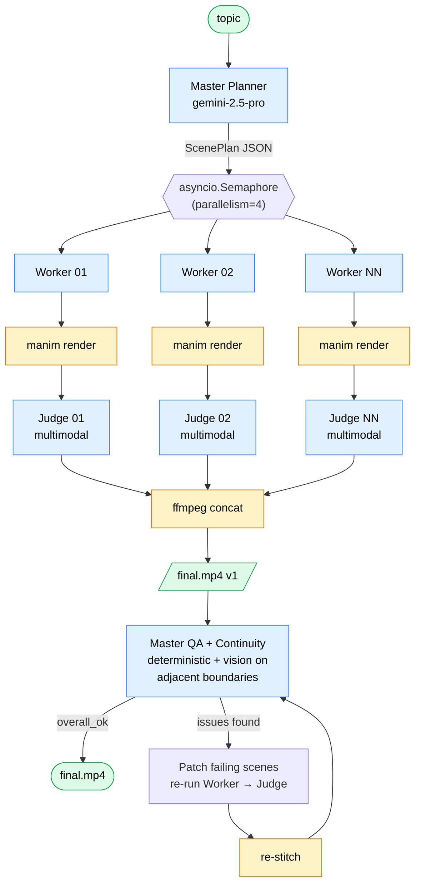

Five LLM-driven roles, each implemented as a plain async function around
Gemini structured output:

| Role          | Module                       | Model used         | Output           |
| ------------- | ---------------------------- | ------------------ | ---------------- |
| Planner       | `src/agents/master.py`       | gemini-2.5-pro     | `ScenePlan`      |
| Worker        | `src/agents/scene_worker.py` | gemini-2.5-pro     | Python file      |
| Judge         | `src/agents/judge.py`        | gemini-2.5-pro (multimodal) | `JudgeReport` |
| Continuity    | `src/agents/continuity.py`   | gemini-2.5-pro (multimodal) | issue list   |
| Master QA     | `src/agents/master.py`       | gemini-2.5-pro     | `QAReport`       |

ADK is referenced conceptually, but in practice we call `google-genai` directly
with `response_schema=` for structured output — that gave us the most reliable
JSON without needing ADK's tool-calling machinery.

---

## 3. Repository layout

```
science-communicator-agent/
├── README.md                # quick-start
├── DOCUMENTATION.md         # ← this file
├── requirements.txt
├── .env.example             # GOOGLE_API_KEY, ELEVENLABS_API_KEY, etc.
├── .gitignore
├── scripts/
│   └── generate.py          # Typer CLI entry point
├── src/
│   ├── gemini_agent.py      # legacy single-shot generator + base SYSTEM_PROMPT
│   ├── compositor.py        # moviepy: mux narration onto video
│   ├── music.py             # ffmpeg: duck/loop a music bed under the mix
│   ├── narrator.py          # standalone TTS helpers (edge-tts / gTTS / ElevenLabs)
│   └── agents/
│       ├── pipeline.py      # top-level orchestrator (asyncio)
│       ├── master.py        # Planner + Master QA + deterministic checks
│       ├── scene_runner.py  # dispatch simple vs complex (sub-scene) rendering
│       ├── scene_worker.py  # generate / render / judge / repair loop per scene
│       ├── judge.py         # vision-based per-scene judge
│       ├── continuity.py    # cross-scene boundary check
│       ├── prompts.py       # all system prompts in one place
│       ├── schemas.py       # dataclasses + Gemini response_schema dicts
│       ├── tts.py           # GeminiTTSService (manim-voiceover adapter)
│       └── tools.py         # subprocess wrappers: manim, ffmpeg, ffprobe
└── scenes/
    ├── example.py                                # SquareToCircle / EulerIdentity demo
    ├── <legacy hand-written or simple-mode files>
    └── <run_id>/                                 # per-run worker outputs
        ├── <slug>.py
        ├── <slug>__a_<sub_slug>.py
        └── ...
```

`output/<run_id>/` (gitignored) holds the artifacts of each run:

```
output/<run_id>/
├── plan.json                     # the ScenePlan from the planner
├── qa.json                       # the latest QAReport
├── continuity.json               # cross-scene boundary issues
├── patch_log.json                # what was re-rendered and why
├── scene_<id>.mp4                # one stable mp4 per scene (concat input)
├── frames_<id>_attempt<N>/       # frames sampled for the judge
├── continuity_frames/            # last/first frames of adjacent scenes
├── judge_<id>_attempt<N>.json    # raw judge reports per attempt
└── final.mp4                     # ← the deliverable
```

When each artifact lands during a run:

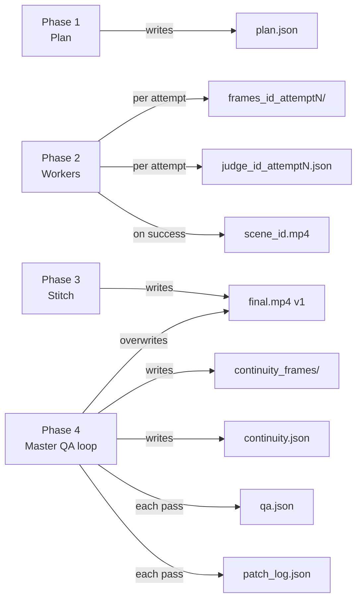

---

## 4. The data model (`src/agents/schemas.py`)

Every agent boundary is a dataclass with a matching JSON schema. The schemas
are passed to Gemini as `response_schema=` so we get back valid JSON.

### Object relationships

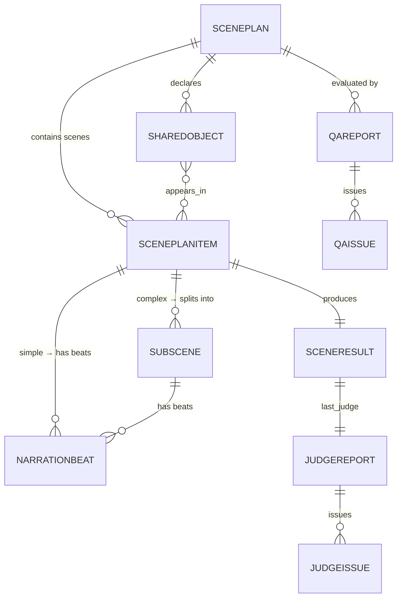

### `ScenePlan` — the planner's output

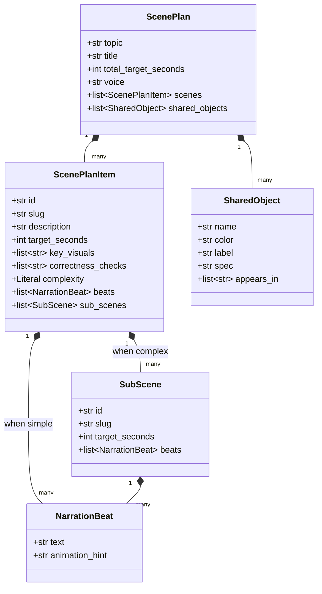

A `NarrationBeat` is `(text, animation_hint)` — the `text` is verbatim TTS
input; `animation_hint` is a free-text instruction the worker uses when
generating the Manim code.

### `SharedObject` — the continuity contract

The single most important structural decision in the plan. Whenever a visual
element appears in two or more scenes (e.g. "the unrolled triangle" that gets
introduced in scene 03 and re-used in scene 04), the planner pins it down with
explicit vertices, color, and label. Workers and the judge both receive this
spec, and the continuity agent later compares boundary frames against it.

### `SceneResult` — the worker's output for one scene

`(id, scene_class, scene_file, video_path, duration_seconds, attempts,
success, last_error, last_judge: JudgeReport)`.

### `JudgeReport` — per-scene visual gate

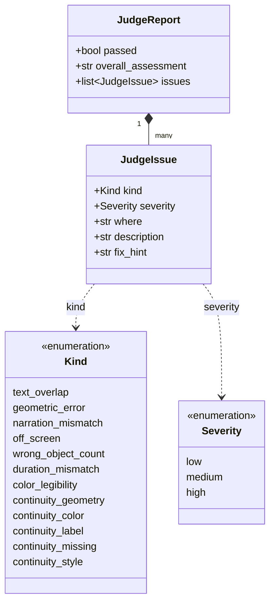

The `fix_hint` field is the load-bearing one — it is fed verbatim back into
the worker as a repair instruction.

### `QAReport` — master/global gate

`(overall_ok: bool, issues: list[QAIssue], notes: str)` — issues here are
cross-scene concerns (pacing, narrative flow, total-duration drift).

---

## 5. End-to-end generation flow

Driver: `src/agents/pipeline.py::run`. All phases are `asyncio` and
`asyncio.to_thread` wraps every blocking SDK / subprocess call.

### End-to-end sequence

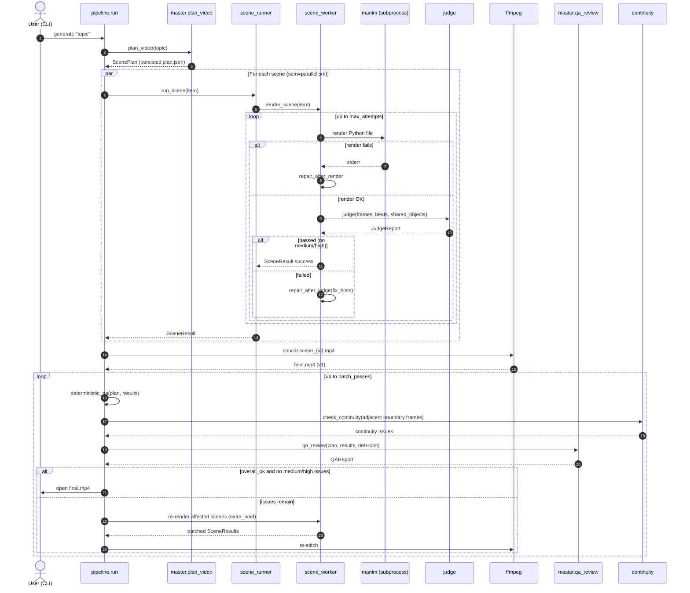

### Phase 1 — Plan

`master.plan_video(topic)` → `ScenePlan`.

- The planner is told to choose a 60–150s total, decompose into 3–7 scenes,
  decide simple-vs-complex per scene, attach `correctness_checks`, pick a
  Gemini TTS voice, and **populate `shared_objects`** for any element that
  spans scenes.
- `_validate_plan` enforces invariants (unique ids, every simple scene has
  beats, every complex scene has sub-scenes with beats). With
  `--no-decompose`, complex scenes are coerced to simple by flattening
  sub-scene beats.
- The plan is persisted to `output/<run_id>/plan.json`.

### Phase 2 — Parallel scene rendering

For each `ScenePlanItem`, `scene_runner.run_scene` is called concurrently
(bounded by `asyncio.Semaphore(parallelism)`, default 4):

- **Simple scene**: one call to `scene_worker.render_scene`.
- **Complex scene**: render every sub-scene through the worker, concatenate
  their mp4s with `ffmpeg`, run a continuity-mode judge on the joined clip.

Inside `scene_worker.render_scene`, for up to `max_attempts` (default 4):

1. **Code generation.**
   - Attempt 1: initial generation from `WORKER_SCENE_PROMPT` + the per-scene
     brief.
   - On render failure: `_generate_repair_after_render` — feeds the broken
     code and last 3 KB of stderr back to Gemini.
   - On judge failure: `_generate_repair_after_judge` — feeds the previous
     code and the formatted judge issues back to Gemini.
2. **Normalisation.**
   - `_ensure_scene_class` renames the class if the model picked something
     other than the expected PascalCase slug.
   - `_normalize_tts` rewrites any `GTTSService` import/call to
     `GeminiTTSService(voice="Aoede")` — guards against the model falling
     back to the legacy gTTS pattern from the base system prompt.
3. **Render** with `tools.render_manim_scene` (subprocess `manim -q<l|m|h|k>
   --disable_caching`, with `PYTHONPATH` set so the generated file can import
   `src.agents.tts`). When `--aspect-ratio` is non-default the resolution
   computed by `tools.resolution_for` is appended as `-r W,H` and the output
   is located in the matching `<H>p<fps>/` directory. The resulting mp4 is
   copied to a stable path (`output/<run_id>/scene_<id>.mp4`) so later phases
   can find it.
4. **Judge** (if `--judge`, default on). N frames sampled at evenly-spaced
   midpoints; sent multimodally to Gemini together with the planned beats,
   the description, the `correctness_checks`, and the relevant
   `shared_objects`. Returns `JudgeReport` — must have zero medium/high
   issues to pass.
5. If the judge passes, return `SceneResult(success=True, …)`. Otherwise
   loop with the judge hints as repair input.

**Best-effort fallback.** If all `max_attempts` are exhausted, the worker
returns the most recent attempt that *rendered* successfully (even if the
judge wasn't fully satisfied). This guarantees the stitcher can include the
scene; the master QA loop gets another shot at fixing it.

Every attempt is persisted to `output/<run_id>/judge_<id>_attempt<N>.json`.

#### Per-scene worker state machine

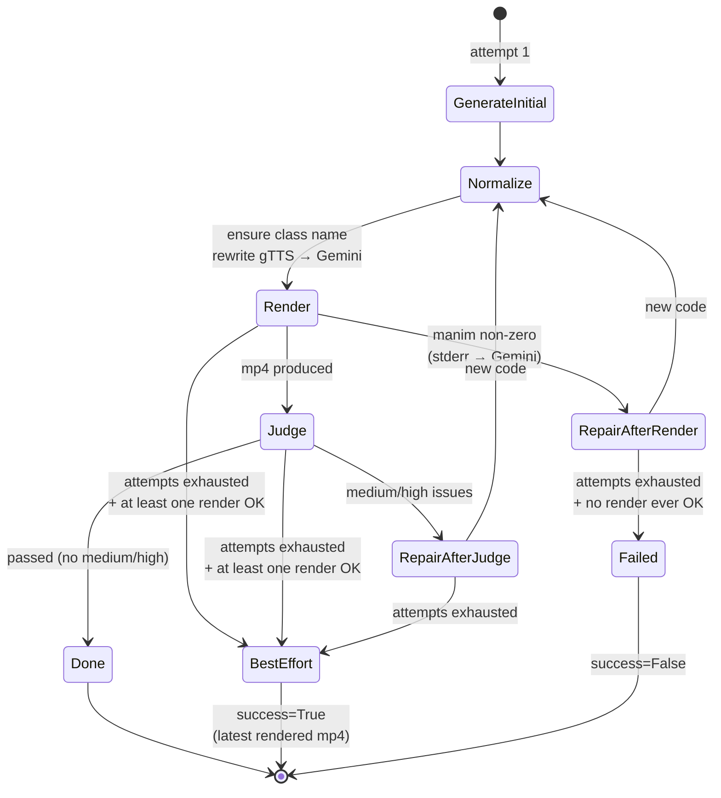

### Phase 3 — Stitch

`pipeline._stitch` collects the successful `scene_<id>.mp4` paths in plan
order and concatenates them with `tools.concat_mp4s`. That helper tries
`-c copy` first; if codecs/timebases drift between scenes it falls back to a
re-encode (`libx264 crf=20`, `aac 192k`).

Output: `output/<run_id>/final.mp4` (v1).

### Phase 4 — Master QA + auto-patch loop

Up to `--patch-passes` (default 2) iterations of:

1. **Deterministic QA** (`master.deterministic_qa`, no LLM): flags missing
   renders, render failures, per-scene duration drift > 40%, total-duration
   drift > 30%.
2. **Continuity check** (`continuity.check_continuity`, when
   `shared_objects` exist and ≥ 2 scenes succeeded): for every adjacent
   `(scene_N, scene_N+1)` pair, extract the last frame of N (0.3s before
   end) and the first frame of N+1 (0.3s in), feed both images plus the
   shared-objects spec to Gemini, get back a list of continuity issues
   (kind: `continuity_geometry | continuity_color | continuity_label |
   continuity_missing | continuity_style`). By default the *later* scene is
   targeted for the fix, since "narrative flows forward".
3. **Master QA review** (`master.qa_review`): the LLM gets the full plan,
   per-scene results, and the deterministic + continuity issues, and emits
   a `QAReport` focused on cross-scene flow and pacing.
4. **Stop condition.** If `qa_report.overall_ok` AND no medium/high
   deterministic-or-continuity issues, the loop exits.
5. **Patch.** Otherwise, every `fix_hint` for a non-global scene is collected
   and sent back to `scene_worker.render_scene` as `extra_brief` (appended
   to the worker's user message under a `# MASTER PATCH NOTES` heading).
   Affected scenes are re-rendered in parallel; the result list is
   patched-in by id and the video is **re-stitched**.

Each pass is logged to `output/<run_id>/patch_log.json`. `qa.json` is
overwritten with the latest report.

#### Patch-loop decision flow

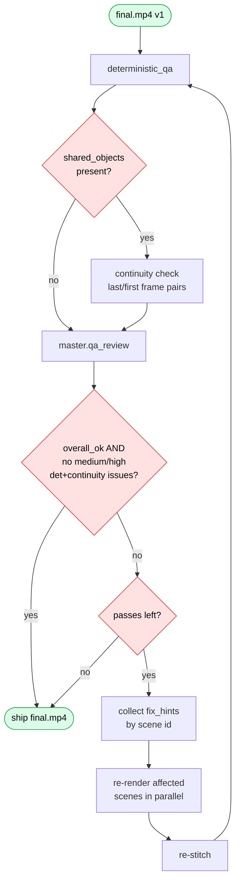

### Optional — background music

If `--music <path>` is passed, `src/music.py::add_background_music` mixes
a music bed under the final video with ffmpeg (`-22 dB` by default,
1.5s fade-in, 2.0s fade-out, looped if shorter than video).

---

## 6. The custom Gemini TTS adapter (`src/agents/tts.py`)

The pipeline does **not** use the gTTS or ElevenLabs services that ship with
`manim-voiceover` — it ships `GeminiTTSService`, a `SpeechService` subclass
that calls `gemini-2.5-flash-preview-tts` directly via `google-genai`.

Implementation notes:

- Voices are passed as `prebuilt_voice_config(voice_name=…)`. Eight voices
  are advertised in the planner prompt: Aoede (default), Puck, Charon, Kore,
  Fenrir, Leda, Orus, Zephyr.
- The model returns inline PCM 16-bit / 24 kHz / mono. We wrap that in a WAV
  header in-memory, then re-export as MP3 with `pydub`. The MP3 detour is
  required because `manim-voiceover` reads duration via `mutagen.mp3.MP3`.
- An optional `style_prompt` is prepended to the input text to bias delivery.
- Caching honours `manim-voiceover`'s `get_cached_result` — repeated runs of
  the same beat won't re-call the API.

`src/narrator.py` keeps standalone helpers for `edge-tts`, `gTTS`, and
ElevenLabs; not wired into the pipeline today, but available for one-off
use.

---

## 7. The base "battle-tested" worker prompt (`src/gemini_agent.py`)

The `SYSTEM_PROMPT` at the top of `gemini_agent.py` predates the multi-agent
work and is reused as the worker's foundation. It encodes hard-won rules
about Manim Community v0.20+:

- **Layout zones** — title/caption/center, with `to_edge` and `next_to`
  rules to prevent overlap.
- **Banned API calls** — `Indicate(scale=…)`, `Circumscribe(fade_out=…)`,
  `FadeIn(scale=…)`, `get_part_by_tex`, etc.
- **Strict LaTeX rules** — raw strings only, amsmath subset only, highlight
  via separate `MathTex` arguments instead of `get_parts_by_tex`.
- **Named colors only** — BLUE / YELLOW / RED / …
- **Output format** — Python only, no fences, no commentary, first line
  must be `from manim import *`.

The base prompt itself targets `GeminiTTSService` directly (the project's
TTS contract is "always Gemini AI voice" — no gTTS / edge-tts / ElevenLabs).
`src/agents/prompts.py::_strip_gtts_from_base` is kept as a defensive no-op
in case the prompt is edited back. `_WORKER_HEADER_OVERRIDE` then appends
multi-agent-specific instructions:

- Mandatory `set_speech_service(GeminiTTSService(voice=...))` as the first
  line of `construct()`.
- Beat faithfulness — one `with self.voiceover(text=beat.text) as tracker:`
  block per beat, in order, text VERBATIM, animations using
  `run_time=tracker.duration`.
- Correctness checks treated as acceptance criteria.
- Shared-objects rules — vertices/color/label drawn EXACTLY per spec; any
  divergence is a high-severity continuity bug.

---

## 8. Quality gates summary

| Gate                | When it runs                          | What it checks                                                  | Severity that gates progress |
| ------------------- | ------------------------------------- | --------------------------------------------------------------- | ---------------------------- |
| Render success      | Every worker attempt                  | Subprocess `manim` exits 0 and produces an mp4                  | Hard fail → repair           |
| Per-scene Judge     | Every successful render               | Layout, geometry, narration match, duration, correctness checks, shared-objects fidelity | medium/high → repair |
| Continuity-mode Judge | After concatenating sub-scenes      | Continuity across the joined clip                               | non-blocking (logged)        |
| Deterministic QA    | Each patch pass                       | Missing renders, render fails, ±40% scene drift, ±30% total drift | medium/high → patch       |
| Continuity check    | Each patch pass (if shared_objects)   | Last/first-frame comparison for shared objects                  | medium/high → patch          |
| Master QA           | Each patch pass                       | Cross-scene narrative flow, pacing                              | medium/high → patch          |

### Where each gate sits

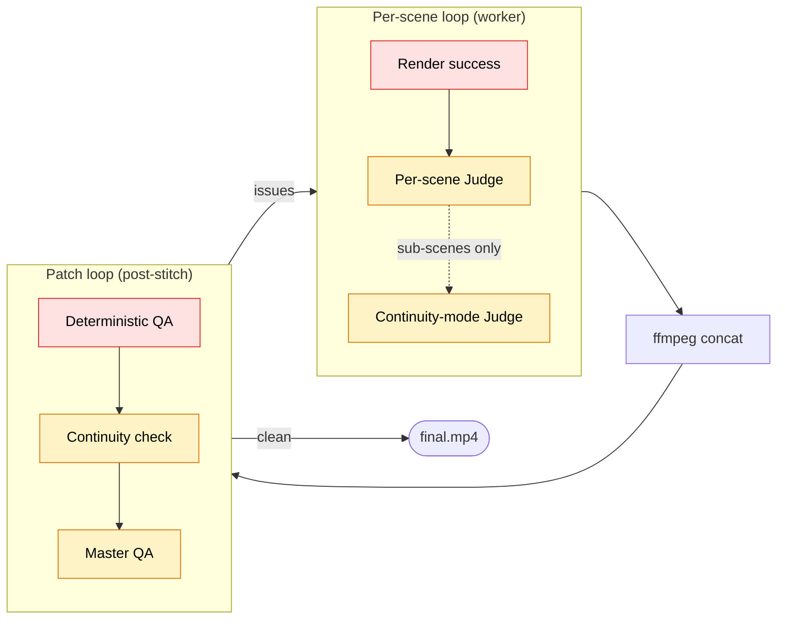

Patch budget: `--patch-passes` (default 2). Per-scene retry budget:
`--max-attempts` (default 4). When budgets are exhausted the system exits
with whatever the best-effort fallback produced so the user always gets a
playable mp4.

---

## 9. CLI surface (`scripts/generate.py`)

```
python scripts/generate.py "Explain the Fourier transform"
```

Common flags:

| Flag                 | Default            | Purpose                                       |
| -------------------- | ------------------ | --------------------------------------------- |
| `--quality l/m/h/k`  | `l`                | Manim render quality (480p15 → 4K60)          |
| `--model`            | `gemini-2.5-pro`   | Gemini model id used by every agent           |
| `--parallelism`      | `4`                | Concurrent scene workers                      |
| `--max-attempts`     | `4`                | Per-scene retry budget                        |
| `--patch-passes`     | `2`                | Master-QA auto-patch limit                    |
| `--qa / --no-qa`     | `--qa`             | Run the master QA loop                        |
| `--judge / --no-judge` | `--judge`        | Run the per-scene visual judge                |
| `--judge-frames`     | `8`                | Frames sampled per scene for the judge        |
| `--no-decompose`     | off                | Disable complex/sub-scene splitting           |
| `--scenes N`         | 0 (planner decides) | Hint for top-level scene count               |
| `--voice`            | from planner       | Override the Gemini TTS voice                 |
| `--run-id`           | timestamp + slug   | Override the run id (controls artifact dirs)  |
| `--music <path>`     | none               | Mix a background music bed under the final    |
| `--simple`           | off                | Use the legacy single-shot generator instead  |
| `--preview/--no-preview` | `--preview`    | `open` the final mp4 when done (macOS)        |
| `--aspect-ratio` / `--aspect` | `16:9`    | Output aspect ratio: `16:9`, `9:16`, `1:1`, `4:5`, `21:9`, … |
| `--parallel / --no-parallel` | `--no-parallel` | Render scenes in parallel (legacy). Default is sequential. |
| `--tool-worker / --no-tool-worker` | `--tool-worker` | Use the Gemini function-calling self-validating worker.  |
| `--max-tool-iterations` | `8`           | Hard ceiling on tool calls per scene (tool-use worker only). |

---

## 9a. Aspect-ratio control

Both pipeline paths accept an `--aspect-ratio` (alias `--aspect`) flag. The
spec is parsed by `tools.parse_aspect_ratio` (accepts `:`, `x`, or `/` as a
separator) into a `(W, H)` tuple, and `tools.resolution_for(aspect, quality)`
maps it to a pixel resolution. Manim is invoked with `-r W,H` and the worker
brief is augmented with orientation-specific layout guidance.

### Resolution policy

The **short side** is anchored to the `--quality` preset. This matches the
colloquial meaning of "1080p" (vertical pixels in landscape, horizontal pixels
in portrait), so `-q h` always gives a "1080p-class" video regardless of
aspect:

| `--quality`       | short side | 16:9       | 9:16       | 1:1        | 4:5        | 21:9        |
| ----------------- | ---------- | ---------- | ---------- | ---------- | ---------- | ----------- |
| `l` (480p15)      | 480 px     | 854×480    | 480×854    | 480×480    | 480×600    | 1120×480    |
| `m` (720p30)      | 720 px     | 1280×720   | 720×1280   | 720×720    | 720×900    | 1680×720    |
| `h` (1080p60)     | 1080 px    | 1920×1080  | **1080×1920** | 1080×1080 | 1080×1350 | 2520×1080   |
| `k` (2160p60)     | 2160 px    | 3840×2160  | 2160×3840  | 2160×2160  | 2160×2700  | 5040×2160   |

The long side is rounded to the nearest even pixel (libx264 requirement).

### How the aspect flows through the pipeline

```mermaid
flowchart LR
    CLI["scripts/generate.py<br/>--aspect 9:16 -q h"] -->|aspect_ratio str| PL[pipeline.run]
    CLI -->|"parse_aspect_ratio<br/>+ resolution_for"| RES["(1080, 1920)"]
    PL -->|aspect_ratio + resolution| SR[scene_runner.run_scene]
    SR -->|aspect_ratio + resolution| SW[scene_worker.render_scene]
    SW -->|aspect_ratio + resolution| BRIEF[build_worker_user_message<br/>+ _aspect_block]
    SW -->|resolution| TOOL["tools.render_manim_scene<br/>manim ... -r W,H"]
    BRIEF --> LLM["Gemini worker<br/>(layout-aware code)"]
    LLM --> SCENE[Manim Scene file]
    SCENE --> TOOL
    TOOL --> MP4[scene_id.mp4]

    classDef io fill:#fef3c7,stroke:#d97706,color:#000
    classDef llm fill:#e1f0ff,stroke:#3b82f6,color:#000
    classDef artifact fill:#dcfce7,stroke:#16a34a,color:#000
    class CLI,TOOL io
    class LLM llm
    class MP4,SCENE,RES artifact
```

### Worker layout guidance

`prompts._aspect_block` injects a context block into the per-scene brief.
Manim keeps `frame_height = 8.0` and scales `frame_width = 8 * W / H`, so
portrait formats produce a much narrower scene-width that can break the
default 3Blue1Brown layout. The block surfaces:

- the chosen aspect ratio + pixel resolution,
- the resulting Manim `frame_width` in scene units (e.g. `4.5` for 9:16,
  `8.0` for 1:1, `14.22` for 16:9),
- orientation-specific tips:
  - **portrait** → favour `VGroup(...).arrange(DOWN)`, wrap text to ~25 chars,
    avoid absolute x-coords beyond `±frame_width/2`, smaller `to_edge` buff;
  - **square** → center the main visualization at `ORIGIN`, fit equations
    inside the central ~70%;
  - **landscape** → standard horizontal layout (status quo).

These hints land in the same brief that already carries beats, key visuals,
correctness checks, and shared-objects specs, so the LLM treats them as
first-class layout constraints rather than free-form advice.

---

## 9b. Sequential pipeline + self-validating tool-use worker

The default pipeline (since v2) runs scenes **sequentially** and gives every
worker a Gemini **function-calling toolbelt** so it can render and inspect its
own output before declaring done. The legacy parallel path is still available
behind `--parallel` for fast batch runs that don't need cross-scene continuity.

### Why sequential

Workers used to fly blind across scene boundaries. The asyncio.gather path
means scene N+1 starts before scene N finishes — its prompt has no idea what
mobjects are on screen at the cut, what naming conventions the prior worker
chose, or what camera state to inherit. The post-hoc continuity check in
`continuity.py` catches drift, but only after every scene has already been
rendered (and re-rendering is what we're trying to avoid).

In sequential mode (`pipeline._run_sequential`) each scene completes before
the next starts; on success we capture an `ending_state` summary (the model
writes it as the argument to its `done()` tool call) and the last frame of
the rendered video, and hand both to the next worker.

### Why tool-use

The text-only worker in `scene_worker.render_scene` is a 4-attempt loop:
generate code → render → if failure, send the stderr back as text → regenerate.
The model never sees the rendered video, just an error message. Geometric
problems ("the triangle came out as a parallelogram"), missing audio, or
continuity drift can only be flagged by the downstream judge — too late.

`scene_worker.render_scene_with_tools` flips this. The model gets a Gemini
`Tool` with five `FunctionDeclaration`s and is forced into `mode=ANY` (no
free-text replies). It iterates: render, inspect frames, probe audio, compare
to prior frame, fix, re-render — until it calls `done(video_path, summary)`.

### Tool inventory

Defined in `src/agents/scene_worker_tools.py`:

| Tool | Returns | Use |
|------|---------|------|
| `render_manim(code, scene_class)` | `success`, `log_tail`, `video_path`, `duration_s` | Write code to fresh attempt dir, run manim |
| `extract_frames(video_path, n)` | list of `{t_seconds, path}` | Sample N PNGs to inspect |
| `probe_audio(video_path)` | `has_audio`, `duration_s` | Verify voiceover rendered |
| `compare_to_prior_frame(this_frame_path)` | `diff_summary` (text) | Vision-diff vs prior scene's last frame |
| `done(video_path, ending_state_summary)` | `accepted` (bool) | Terminal — required to exit the loop |

Each call lands in `output/<run_id>/<scene_id>/attempts/<NN>/`:

```
attempts/01/
  scene.py        # the code passed to render_manim
  scene.mp4       # rendered video (if success)
  log_tail.txt    # last 2000 chars of manim stdout/stderr
  frames/         # extract_frames output
```

The hard ceiling is `--max-tool-iterations` (default 8). On exhaustion, the
worker returns the most recent successful render as best-effort with an empty
`ending_state` (so the next scene's continuity hint is degraded but the run
still completes).

### Prior-context handoff

`schemas.PriorContext` is the payload threaded between scenes:

```python
PriorContext(
    prior_scene_id="01",
    last_frame_path=Path(".../output/<run_id>/01/last_frame.png"),
    ending_state="Blue circle of radius 2 centred at ORIGIN; label 'r=2' below.",
    prior_code_path=Path(".../scenes/<run_id>/show_circle.py"),
)
```

`prompts._prior_context_block` injects the ending-state text and the prior
scene's full Python source into the next worker's brief. The last frame is
attached separately as a multimodal `Part.from_bytes` so the model literally
sees what the previous scene faded to. The prior code helps the worker match
naming and mobject construction conventions so persistent objects stay visually
identical.

### Sequential vs parallel — flow comparison

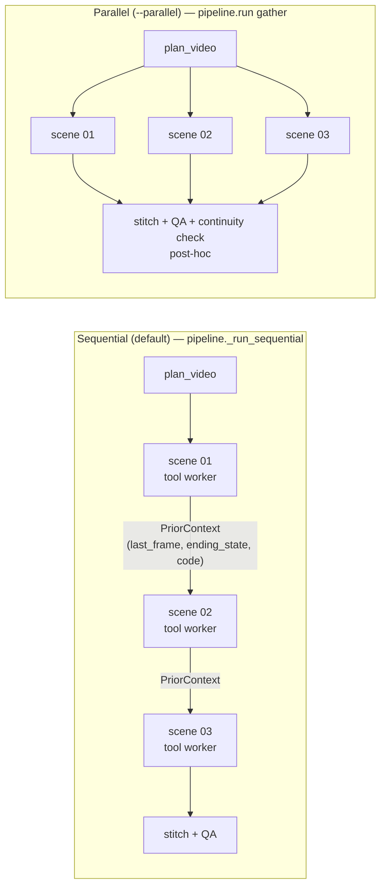

### Tool-use loop (per scene)

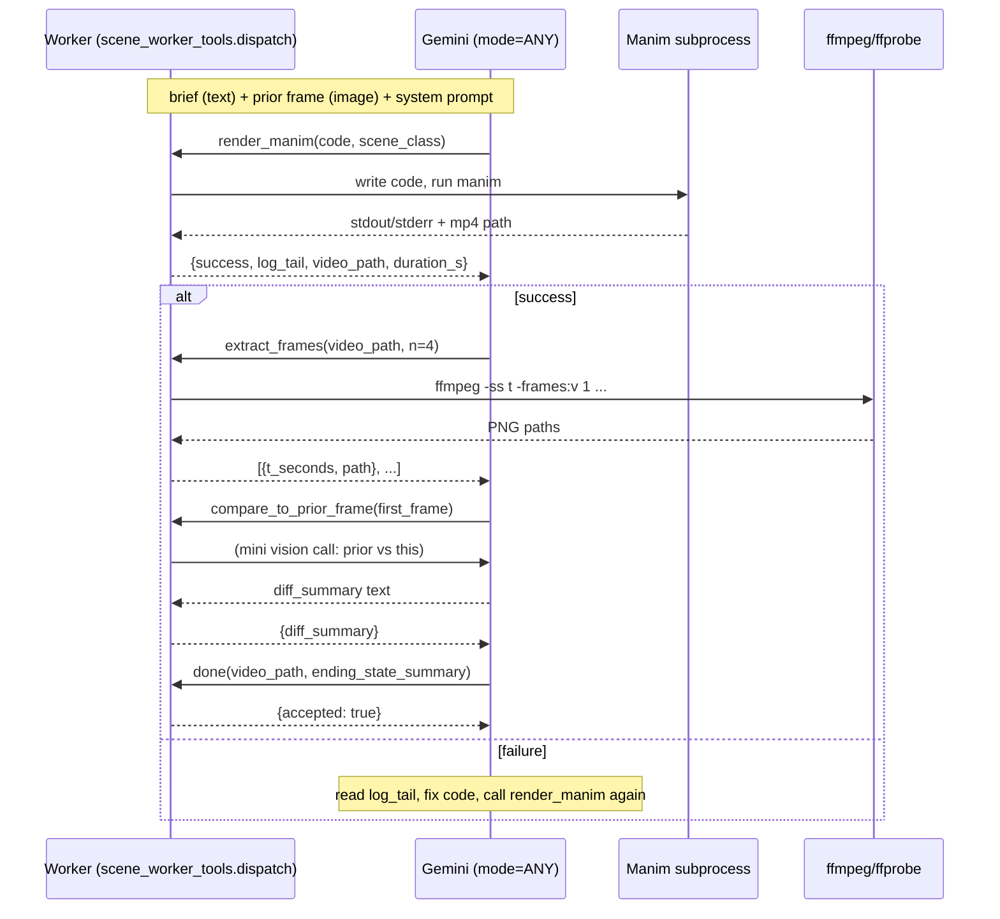

### CLI summary

| Flag | Default | Effect |
|------|---------|--------|
| (none — sequential is default) | sequential | Scenes rendered one at a time, prior-context threaded |
| `--parallel` | off | Restore legacy `asyncio.gather` path; no prior context |
| `--tool-worker` (default on) | on | Use the function-calling worker |
| `--no-tool-worker` | — | Fall back to legacy text-only repair worker (still useful with `--parallel`) |
| `--max-tool-iterations` | `8` | Cap on tool calls per scene |

### Hooks for `--plan-mode`

`pipeline.run` accepts two optional callables, both defaulting to no-op pass-
through. `--plan-mode` (§9c) wires them up; you can also build your own
callbacks for non-CLI contexts (notebooks, web UI):

- `pre_plan_approval(plan: ScenePlan) -> ScenePlan` — fired after the planner
  returns. Whatever the callback returns becomes the working plan.
- `post_scene_approval(item, result, rerun) -> SceneResult` — fired after
  each scene completes in sequential mode. `rerun(extra_brief)` is a closure
  the pipeline injects so the callback can request re-renders without
  needing the rest of the run-state. Callable accepts a `str | None`
  (additional brief / no-op retry) and returns the new `SceneResult`.

Both callables can be sync or async — `pipeline._maybe_await` handles either.

---

## 9c. `--plan-mode`: human-in-the-loop review

The default sequential pipeline (§9b) is fully autonomous. `--plan-mode`
swaps in two interactive gates:

1. **Plan gate** — review the planner's output before any rendering starts.
2. **Per-scene gate** — review every rendered scene before the next starts.

Both gates loop until you approve (or hit a 5-round revision cap, or quit).

```bash
python scripts/generate.py "Why does pi appear in a Gaussian?" --plan-mode
python scripts/generate.py "..." --plan-mode --no-plan-mode-open  # SSH-friendly
```

`--plan-mode` requires sequential mode; passing `--parallel` together is
rejected at CLI parse time.

### Lifecycle

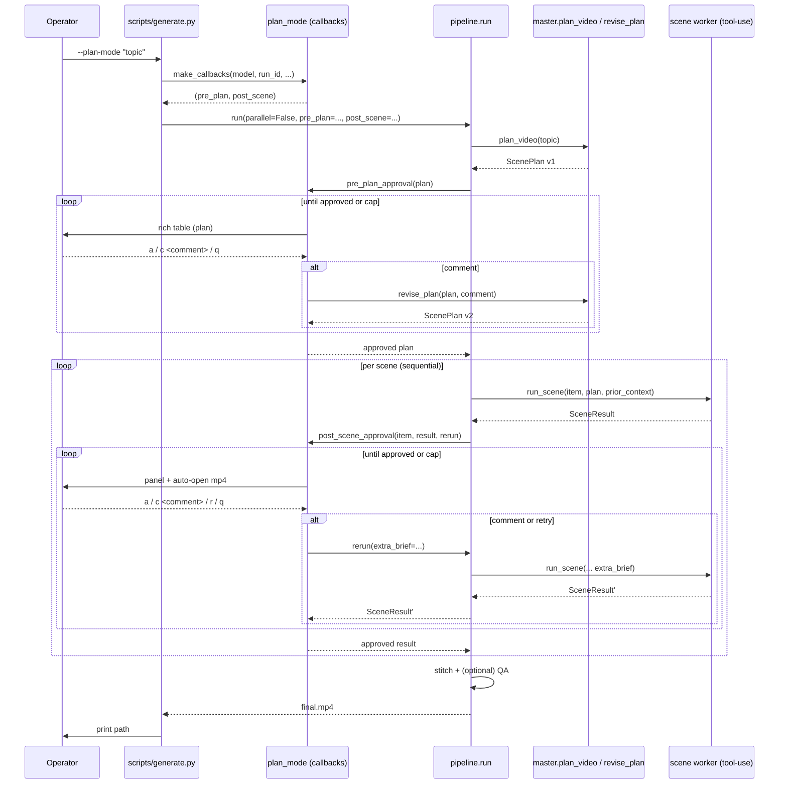

### CLI surface

| Flag | Default | Effect |
|------|---------|--------|
| `--plan-mode` | off | Enable both gates. Forces `--no-parallel` and force-disables QA. |
| `--no-plan-mode-open` | (off when `--plan-mode-open` is on) | Suppress the `open <path>` call when each scene renders. |
| `--plan-mode-max-rounds N` | `5` | Cap on revision rounds per plan/scene. |
| `--qa` (with `--plan-mode`) | ignored | QA is force-off in plan-mode; you've already approved each scene. |

### Action keys

| Key | Plan gate | Scene gate |
|-----|-----------|-----------|
| `a` | approve plan, continue to render | approve scene, continue to next |
| `c` | comment + revise plan via LLM | comment + re-render scene |
| `r` | — | retry scene without a comment |
| `q` | abort with exit code 2 | abort with exit code 2 |

Either the literal letter or the prefix of the label works (`approve`, `comm`,
etc.). Pressing Enter takes the default (`a`).

### Persistence

Every action is appended to `output/<run_id>/reviews.jsonl`:

```jsonl
{"ts": "2026-04-29T18:30:00Z", "phase": "plan", "scene_id": null, "action": "comment", "comment": "make scene 02 shorter"}
{"ts": "...", "phase": "plan", "scene_id": null, "action": "approve", "comment": null}
{"ts": "...", "phase": "scene", "scene_id": "01", "action": "approve", "comment": null}
{"ts": "...", "phase": "scene", "scene_id": "02", "action": "comment", "comment": "shrink the square"}
{"ts": "...", "phase": "scene", "scene_id": "02", "action": "approve", "comment": null}
```

Used today only as an audit trail. Resumability across runs and backtracking
to earlier scenes are deferred.

### Gotchas

- **Rendering takes minutes.** Each scene's tool-use loop typically does 1–3
  manim renders, each ~30–120s at `--quality l`. Plan-mode adds prompts but
  doesn't change render cost.
- **API spend on tight comment loops.** Each plan revision is one Gemini
  call; each scene re-render with a comment can be 4–8 Gemini calls plus
  TTS. The 5-round cap protects you from a runaway loop, but a deliberate 5
  rounds × 4 scenes is still ~80 Gemini calls.
- **macOS-only auto-open.** `open <path>` is macOS; `xdg-open <path>` is the
  Linux fallback. Other platforms silently skip.
- **stdin in non-tty contexts.** `typer.prompt` reads from stdin. You can
  pipe approvals (`printf 'a\na\n' | python scripts/generate.py ...`) but
  most users will run interactively. `--plan-mode` over SSH works as long as
  you have stdin and don't need auto-open (`--no-plan-mode-open`).

---

## 10. Configuration (`.env`)

Copy `.env.example` → `.env` and fill in:

- `GOOGLE_API_KEY` — required; used by the planner, workers, judge,
  continuity agent, master QA, **and** the TTS adapter.
- `GOOGLE_GENAI_USE_VERTEXAI` — default `false` (AI Studio). Set to `true`
  with `GOOGLE_CLOUD_PROJECT` / `GOOGLE_CLOUD_LOCATION` to use Vertex.
- `GEMINI_MODEL` — default `gemini-2.5-pro`. CLI `--model` overrides.
- `ELEVENLABS_API_KEY` — only needed for the standalone `narrator.py`
  helper; the pipeline doesn't use it.
- `DEFAULT_QUALITY`, `OUTPUT_DIR` — for the simple-mode legacy path.

System dependencies: `cairo`, `pango`, `ffmpeg`, optionally `MacTeX` /
`BasicTeX` for LaTeX-rendered math, `sox` (used by `manim-voiceover`).

---

## 11. Test cases and legacy scenes

The working tree under `scenes/` shows several runs already produced under
the new pipeline (timestamped run-id directories from `2026-04-29`), each a
multi-scene attempt at the same families of topics (sum 1+2+…+n, area of a
circle = πr², π in the normal distribution). These are good test cases —
they exercise both the simple flow and complex/sub-scene decomposition with
shared objects (the unrolled-triangle example in particular).

Legacy single-shot scenes (`piinnormaldistribution.py`,
`piinthenormaldistribution.py`, `unrollcirclearea.py`,
`generatedscene.py`) live at the top of `scenes/` from before the
per-run-id subdirectory convention.

---

## 12. Notable design decisions

- **`google-genai` over ADK.** Conceptually we have "agents", but every
  role just needs structured JSON. `genai.Client.generate_content(...,
  response_schema=...)` is simpler, faster, and gives us deterministic
  JSON without ADK's tool-calling overhead. ADK is referenced in the
  README and `requirements.txt` but the pipeline doesn't import it.
- **Schemas kept minimal.** Gemini's structured-output constraint solver
  rejects schemas with too many states (long enums, deep nesting,
  `minItems` / `maxItems`, `propertyOrdering`). The schemas in
  `schemas.py` describe only the JSON shape; everything else is policed
  via the prompt and `_validate_plan`.
- **Best-effort fallback in the worker.** A scene that renders but flunks
  the judge is still returned as `success=True` with the most recent
  rendered mp4. The patch loop gets another chance; the user always gets
  a playable final video.
- **Stable per-scene mp4 paths.** Each rendered scene is copied to
  `output/<run_id>/scene_<id>.mp4` immediately after render. The stitcher
  and continuity agent both rely on these stable paths, decoupled from
  manim's deeply nested `media/videos/<stem>/<quality>/<class>.mp4`
  output tree.
- **MP3 detour for TTS.** Gemini TTS hands back PCM, but
  `manim-voiceover`'s duration probe only understands MP3 — so we wrap
  PCM in WAV in memory, then re-export as MP3 via pydub. The detour is
  cheap and keeps us on the published `manim-voiceover` cache contract.
- **`--no-decompose` escape hatch.** Sub-scene rendering is the most
  expensive code path (one worker per sub-scene, plus a continuity-mode
  judge on the concatenation). The flag flattens any "complex" plan back
  to "simple" beats so users can skip it for cheap iteration.
- **Cross-scene continuity gates the patch loop, not the worker.** The
  continuity check runs against final per-scene mp4s, after all workers
  have settled. That avoids re-rendering a scene many times for a
  mismatch its neighbour caused, and keeps the per-scene worker feedback
  loop fast and local.

---

## 13. Quick start

```bash
source .venv/bin/activate
pip install -r requirements.txt
cp .env.example .env       # add GOOGLE_API_KEY

# Smoke test the install
manim -pql scenes/example.py SquareToCircle

# Generate a video with the multi-agent pipeline
python scripts/generate.py "Show why the area of a circle is pi r squared" \
    --quality l --parallelism 4 --patch-passes 2

# Generate vertically (Shorts / Reels / TikTok) at 1080×1920
python scripts/generate.py "Why does pi appear in a Gaussian?" \
    --aspect 9:16 --quality h

# Square (1:1) or 4:5 for Instagram-style feeds
python scripts/generate.py "..." --aspect 1:1 --quality h
python scripts/generate.py "..." --aspect 4:5 --quality h

# Or fall back to the single-shot legacy generator
python scripts/generate.py "Explain Euler's identity" --simple
```

The final video is at `output/<run_id>/final.mp4`; on macOS it auto-opens
unless `--no-preview` is passed.
