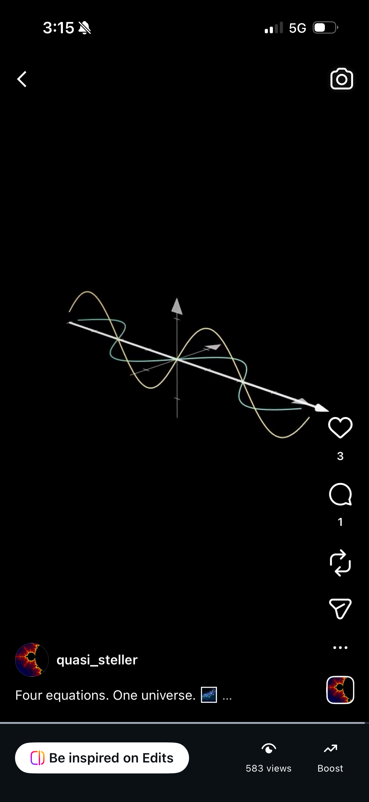
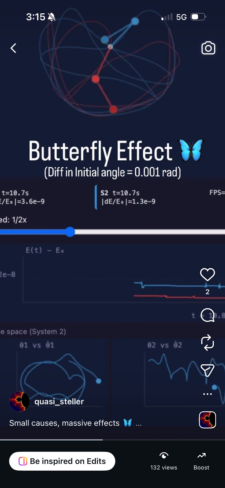

# Science Communicator

A 3Blue1Brown-style video & animation pipeline. Combines **Manim** for mathematical
animation, **MoviePy/ffmpeg** for editing, **TTS engines** for narration, and the
**Google Agent Development Kit (ADK)** with Gemini for AI-driven script generation
and scene planning.

## Stack

| Layer | Tool |
|-------|------|
| Animation engine | [Manim Community](https://www.manim.community/) |
| Video editing | MoviePy + ffmpeg |
| Narration | edge-tts / gTTS / ElevenLabs |
| AI scripting | Google ADK + Gemini |

## Sample outputs

Frames pulled from videos generated by the pipeline:

<p align="center">
  
  &nbsp;&nbsp;
  
</p>

## Setup

```bash
# 1. Activate the virtualenv (already created at .venv/)
source .venv/bin/activate

# 2. Install dependencies
pip install -r requirements.txt

# 3. System deps (already present): cairo, pango, ffmpeg
#    For LaTeX-rendered math, install MacTeX or BasicTeX:
brew install --cask mactex-no-gui   # ~4 GB, full
# OR: brew install --cask basictex  # smaller

# 4. Copy env template and add your keys
cp .env.example .env
# edit .env with GOOGLE_API_KEY, etc.
```

## Project layout

```
science-communicator/
├── scenes/        # Manim scene scripts (one .py per video)
├── src/           # Reusable helpers (AI agents, TTS, compositors)
├── scripts/       # CLI entry points (e.g. generate-from-prompt)
├── assets/        # Static images, fonts, sound effects
├── output/        # Rendered videos
├── requirements.txt
└── .env
```

## Quick start — render a sample scene

```bash
manim -pql scenes/example.py SquareToCircle
# -p = preview, -ql = low quality (fast). Use -qh for HD, -qk for 4K.
```

## Generate a video from a prompt (Gemini + Manim)

```bash
# Default 16:9 landscape — sequential + self-validating tool-use worker
python scripts/generate.py "Explain the Fourier transform visually"

# Vertical / Shorts / Reels (9:16)
python scripts/generate.py "Why does pi appear in a Gaussian?" --aspect 9:16 --quality h

# Square / Instagram (1:1) and 4:5
python scripts/generate.py "..." --aspect 1:1
python scripts/generate.py "..." --aspect 4:5

# Legacy parallel mode (faster, no prior-scene context, no self-validation)
python scripts/generate.py "..." --parallel --parallelism 4
```

`--aspect-ratio` (alias `--aspect`) accepts forms like `16:9`, `9:16`, `1:1`,
`4:5`, `21:9`. The short side is anchored to the `--quality` preset
(`l`/`m`/`h`/`k` → 480/720/1080/2160 px), so `--aspect 9:16 --quality h`
produces a 1080×1920 video. Manim is invoked with `-r W,H` and the worker
prompt is adjusted with layout guidance for portrait/square frames.

### Sequential pipeline (default)

Scenes render one at a time. Each worker is a Gemini function-calling agent
that drives its own render → inspect → fix loop using these tools:

- `render_manim(code, scene_class)` — write code to disk, run manim, get back
  success/log_tail/video_path/duration
- `extract_frames(video_path, n)` — sample frames as PNGs and inspect them
- `probe_audio(video_path)` — verify the voiceover rendered
- `compare_to_prior_frame(this_frame_path)` — vision-diff against the prior
  scene's last frame to catch continuity drift
- `web_search(query)` — Google-grounded lookup for stuck library errors
- `done(video_path, ending_state_summary)` — terminal call; the summary is
  handed to the next scene's worker for visual continuity

Scene N+1 receives scene N's last-frame PNG, the `ending_state_summary` text,
and scene N's full Python source. The hard ceiling on tool calls per scene is
`--max-tool-iterations` (default 12).

### Full-video reviewer (default on)

After the worker calls `done()`, the rendered mp4 is uploaded to Gemini for
an industry-bar review. The reviewer watches the video end-to-end and grades
it on animation timing, narration sync, text readability, motion quality,
mathematical correctness, color palette, and continuity with the prior scene.
Every issue carries a timestamp range + concrete fix hint.

If the reviewer flags issues, the worker conversation is **resumed** with the
formatted feedback as a synthetic user turn — preserving the model's memory
of why it made specific choices — and re-runs `render_manim` → `done()` on
the same scene. Capped at `--max-review-rounds` (default 2), with thrashing
detection that exits early when no high-severity issue from the previous
round was resolved.

```bash
python scripts/generate.py "..." --no-video-review        # disable
python scripts/generate.py "..." --max-review-rounds 3    # extra rounds
python scripts/generate.py "..." --video-review-model gemini-2.5-pro
```

On Files-API failure (upload, processing, or generate), the reviewer
falls back to extracting 8 frames and using the same prompt — single source
of truth, two delivery paths. Per-round verdicts persist to
`output/<run_id>/<scene_id>/video_review_round_N.json`.

The reviewer is automatically skipped during master-QA-driven re-renders
(the master already provided structured patch hints).

### Parallel pipeline (`--parallel`)

The legacy path: every scene rendered concurrently, no cross-scene context,
post-hoc continuity check. Faster wall-clock when continuity isn't critical.

### Interactive review with `--plan-mode`

Human-in-the-loop. Required for both gates: approve the master's plan before
any rendering starts, and approve every scene before continuing to the next.

```bash
python scripts/generate.py "Why does pi appear in a Gaussian?" --plan-mode
```

Flow:
1. The planner emits a `ScenePlan`.
2. You see a rich table with each scene's id, duration, description, and
   beats. Press `[a]` to approve, `[c]` to comment, or `[q]` to quit.
3. On `c`, you type one line of feedback; the planner rewrites the plan with
   your feedback applied. Loop until approval (capped at 5 rounds).
4. Phase 2 starts. Each scene renders sequentially with the tool-use worker.
5. After each scene renders, the mp4 auto-opens (macOS QuickTime). Press
   `[a]` to approve, `[c]` to comment + re-render, `[r]` to retry without a
   comment, or `[q]` to quit.
6. **Comment translation.** When you press `[c]` and type a free-form comment
   ("equation looks weird", "make it slower"), the rendered video + your
   comment are sent to the video reviewer, which translates the vague
   feedback into structured, timestamped, code-anchored fix hints before
   passing them to the worker. On reviewer failure the raw comment is sent
   instead — never blocks your intent on reviewer availability. Each
   translation persists to
   `output/<run_id>/<scene_id>/video_review_planmode_N.json`.
7. Once approved, the next scene's worker starts with your approved scene's
   ending state as its prior context.
8. Stitch + finish.

`--plan-mode` requires sequential mode (no `--parallel`). The QA loop is
forced off in plan-mode (you've already approved every scene; QA would
re-render silently and second-guess the operator).

Other plan-mode flags:
- `--no-plan-mode-open` — don't auto-open the rendered mp4 (useful over SSH).
- `--plan-mode-max-rounds N` — cap on revision rounds per plan/scene
  (default 5; the cap is a guard against runaway feedback loops).

Every action is appended to `output/<run_id>/reviews.jsonl` for audit.

## Notes

- `manim` (community) and `manimgl` (3B1B's original) are different libraries.
  Default to `manim`; `manimgl` is included for reference.
- LaTeX is required for `MathTex` / `Tex` objects. Without it, use `Text` only.
