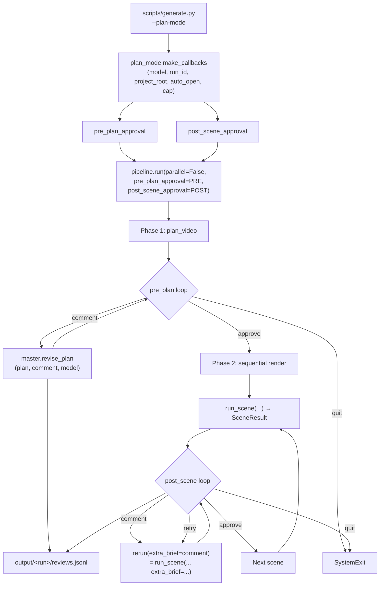

# `--plan-mode`: human-in-the-loop plan + per-scene review

**Status**: design approved (2026-04-29). Implementation pending.

## Problem

Phase 1+2 (sequential pipeline + self-validating tool-use worker) shipped on
2026-04-29. Workers now render and inspect their own output, and prior-scene
context propagates between scenes. Two pipeline hooks were intentionally left
behind for Phase 3:

- `pipeline.pre_plan_approval(plan) -> ScenePlan`
- `pipeline.post_scene_approval(item, result) -> SceneResult`

Both default to no-op pass-through. Phase 3 wires interactive review into them
behind a `--plan-mode` flag, giving the operator approval gates around the
planner's output and around every rendered scene before the run continues.

## Goals (v1)

1. After the planner emits a `ScenePlan`, display it as a rich table and let
   the user approve, comment-and-revise, or quit.
2. After each scene renders successfully (sequential mode), auto-open the
   rendered mp4 and let the user approve, comment-and-rerun, retry-without-
   comment, or quit.
3. Persist every action (approve / comment / retry) to
   `output/<run_id>/reviews.jsonl` for audit.
4. Cap each revision loop at 5 rounds; warn and accept the last result on cap.
5. `--plan-mode` requires sequential mode; reject `--parallel --plan-mode` at
   CLI parse time.

## Non-goals (deferred)

- Backtracking to a previously approved scene.
- Resuming a killed run from the last approved scene.
- Multi-line comment input (single-line `typer.prompt` only).
- Reviewing intermediate tool-worker attempts; the user reviews the final
  rendered scene only.
- Saving / replaying review transcripts as fixtures.

## Architecture



### Components

#### NEW `src/agents/plan_mode.py`

Pure interactive-UI module. Imports rich + typer + master.revise_plan. Exposes:

```python
def make_callbacks(
    *, model: str, run_id: str, project_root: Path,
    auto_open: bool = True, max_rounds: int = 5,
) -> tuple[PrePlanApproval, PostSceneApproval]:
    """Construct the two callbacks pipeline.run accepts."""

# Internal helpers (used by the callbacks):
def display_plan(plan: ScenePlan) -> None
def display_scene_result(item, result) -> None
def prompt_action(choices: list[str]) -> str        # 'a','c','r','q'
def prompt_comment() -> str                          # single-line
def append_review(path: Path, **fields) -> None      # JSONL writer
async def interactive_plan_approval(plan, model, ...) -> ScenePlan
async def interactive_scene_approval(item, result, rerun, ...) -> SceneResult
```

#### MODIFY `src/agents/master.py` + `src/agents/prompts.py`

Add `revise_plan(plan: ScenePlan, feedback: str, *, model) -> ScenePlan`.
Uses the same `SCENE_PLAN_SCHEMA` and a new `MASTER_PLAN_REVISION_PROMPT`
that explains: "Here is the current plan. The user said: <feedback>. Apply
their feedback while preserving everything else. Re-emit the full ScenePlan
JSON."

#### MODIFY `src/agents/pipeline.py`

Change the `post_scene_approval` hook signature from `(item, result) -> r` to
`(item, result, rerun) -> r`, where `rerun: Callable[[Optional[str]], Awaitable[SceneResult]]`
is a closure built per scene that re-runs `run_scene` with the same args plus
the supplied `extra_brief`.

```python
# pipeline.py inside the sequential loop
async def _rerun_factory(item, prior, **fixed_args):
    async def rerun(extra_brief: Optional[str]) -> SceneResult:
        return await run_scene(
            item, plan, ..., extra_brief=extra_brief,
            prior_context=prior,
        )
    return rerun

if post_scene_approval is not None:
    rerun = _rerun_factory(item, prior, ...)
    r = await _maybe_await(post_scene_approval(item, r, rerun))
```

The patch loop (Phase 4) is **not** wrapped in approval. When `--plan-mode`
is set, we default `--no-qa`, so the patch loop is normally skipped. If the
user explicitly opts back into QA with `--plan-mode --qa`, the patch loop
runs without per-scene prompts (re-rendering happens silently). The user
will see the final stitched mp4 and any QA findings in `qa.json`, but no
prompt fires for those automated repairs. This is intentional: the operator
already individually approved each scene during Phase 2, and asking them to
review again every time QA disagrees would be tedious and would defeat QA's
purpose.

#### MODIFY `scripts/generate.py`

Add `--plan-mode/--no-plan-mode` (default off) and `--plan-mode-open/--no-plan-mode-open`
(default on). When `--plan-mode` is set:
1. Require `--no-parallel` (raise typer.BadParameter if `--parallel`).
2. Build callbacks via `plan_mode.make_callbacks(...)`.
3. Pass them to `pipeline.run`.
4. Default `--no-qa` (the user has approved every scene; the QA loop adds
   noise). User can re-enable with explicit `--qa`.

### Data flow

#### Plan revision

1. User presses `c` after seeing the rich plan table.
2. `prompt_comment()` reads one line via `typer.prompt`.
3. `master.revise_plan(plan, comment, model)` is called via `asyncio.to_thread`.
4. The new plan replaces the old one; `pipeline.run` already re-persists
   `plan.json` after `pre_plan_approval` returns.
5. Loop until approval or cap.

#### Scene revision

1. After `run_scene` returns, the post-hook is invoked.
2. `auto_open` triggers `subprocess.run(['open', video_path])` once per
   render (no popup spam for retries).
3. `prompt_action` returns one of `a/c/r/q`.
4. On `c` or `r`, `rerun(extra_brief=...)` is awaited; the new result
   replaces the old, the inner loop runs again.
5. The loop returns the final result; `pipeline.run` resumes.

#### Persistence

`output/<run_id>/reviews.jsonl` is appended on every user action:

```jsonl
{"ts": "2026-04-29T20:30:00Z", "phase": "plan", "scene_id": null, "action": "comment", "comment": "shorter narration in scene 02"}
{"ts": "...", "phase": "plan", "scene_id": null, "action": "approve"}
{"ts": "...", "phase": "scene", "scene_id": "01", "action": "approve"}
{"ts": "...", "phase": "scene", "scene_id": "02", "action": "comment", "comment": "make the square smaller"}
```

### Error handling

- `revise_plan` raises (LLM error, schema mismatch): print error, keep old
  plan, prompt again. User can `q` to abort.
- `rerun` raises: ditto for the scene loop.
- `auto_open` fails (no `open` binary, e.g. Linux/CI): silently fall through
  and print path only.
- 5-round cap hit: print warning, return last result, log to jsonl.
- `KeyboardInterrupt` (^C) during prompt: re-raise to abort run cleanly.

### Testing

Interactive code is tricky to unit-test, but most plan-mode logic is
deterministic given fixed input. Smoke test plan:

1. **Pure-function units** (no API calls):
   - `display_plan(sample_plan)` runs without exception.
   - `append_review(...)` writes valid JSONL line.
   - `prompt_action` parses `a/c/r/q` from a stdin string.
2. **Scripted-stdin integration**: `printf 'a\na\na\n' | python scripts/generate.py "..." --plan-mode --quality l --scenes 2 --no-decompose --no-preview` should approve plan + 2 scenes and exit 0.
3. **Comment loop**: `printf 'c\nshrink it\na\na\na\n' | python scripts/generate.py ...` should call `revise_plan` once, then approve.
4. **Parallel rejection**: `python scripts/generate.py "..." --plan-mode --parallel` should error before any LLM call.

Live interactive testing is the user's responsibility — verify auto-open
works on their macOS, the prompts read correctly, and the table renders well
in their terminal width.

## Open risks

- **API spend in tight comment loops**: each comment triggers a Gemini call.
  5-round cap mitigates but doesn't eliminate; document this.
- **Auto-open over SSH**: `open` does nothing useful on a remote host. The
  `--no-plan-mode-open` flag is the escape hatch.
- **rich + typer in non-tty**: the prompts may misbehave when stdin isn't a
  tty. We accept this — plan-mode is opt-in and assumes interactive use.

## Verification

- Unit smoke for the pure functions above (one-liner pytest or inline run).
- Scripted-stdin smoke (above) — confirm exit 0 and `final.mp4` exists.
- Manual interactive run by the user — confirm prompts, auto-open, and
  jsonl audit trail.

## Files touched

| File | Change |
|------|--------|
| `src/agents/plan_mode.py` | NEW — interactive UI helpers + callback factory |
| `src/agents/master.py` | ADD `revise_plan(plan, feedback, model)` |
| `src/agents/prompts.py` | ADD `MASTER_PLAN_REVISION_PROMPT` |
| `src/agents/pipeline.py` | EXTEND `post_scene_approval` signature; build `rerun` closure per scene |
| `scripts/generate.py` | ADD `--plan-mode`, `--plan-mode-open`; reject `--parallel --plan-mode` |
| `README.md` | DOCUMENT `--plan-mode` workflow |
| `DOCUMENTATION.md` | NEW section §9c with sequence diagram + usage |
